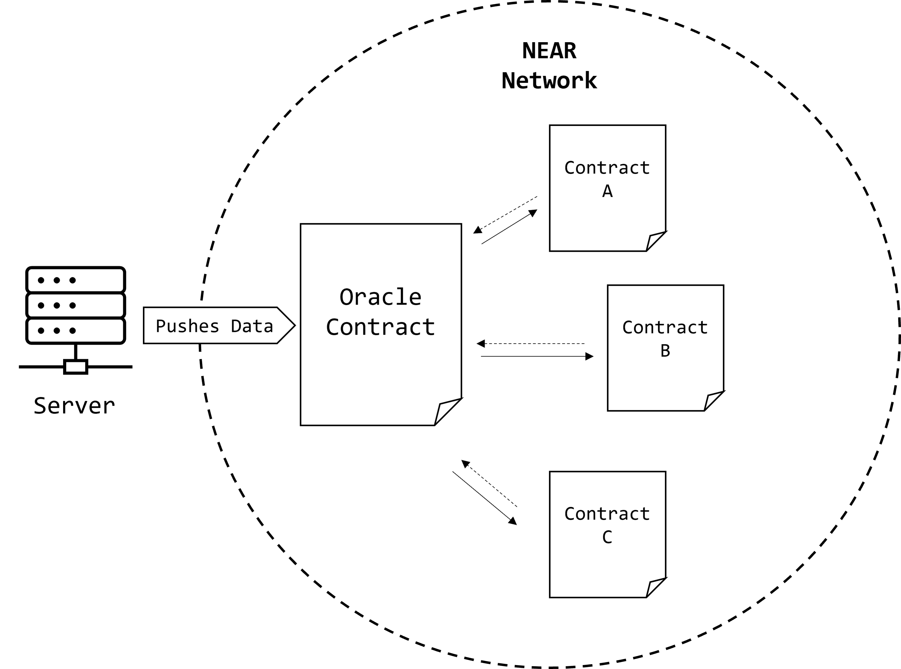

# Simple Coingecko Oracle
This repo contains a simple Coingecko oracle contract written in JavaScript (with [near-sdk-js](https://github.com/near/near-sdk-js)) that can be used to query the price of a cryptocurrency from within the network, in this case NEAR. The goal behind this example is to show how oracles can obtain their data from the outside world, and how they can be used to provide data to the network. 

The project is divided into two parts:
  - The first part is the oracle, which is a smart contract that can be queried from within the network for information and is deployed to `testnet`.
  - The second part is the server, which holds the keys to the only account that can push data to the oracle.

The folder structure matches this pattern too:

```
├── .github                         ⟵ contains GitHub Actions yml files for testing and running the code that pushes data to the testnet oracle
├── contract
   └── src                          ⟵ oracle contract code
   └── tests                        ⟵ integration tests for the oracle
├── scripts                         ⟵ contains helper scripts, e.g. deploying contract in GitHub CI  
├── server
   └── src                          ⟵ server code that pushes data to the oracle
   └── tests                        
        └── e2e                     ⟵ end-to-end tests for the server and contract
        └── integration/api         ⟵ integration tests for the server and source data
```

## Schematic Overview

This diagram demonstrates the interaction between the oracle, the network (other smart contracts and accounts) and the server:



## The Oracle Contract
This contract is deployed to `oracle.idea404.testnet` and can be queried by calling the `getPrices` method. You can try it out by running this command on your shell (requires having the [near-cli](https://github.com/near/near-cli) installed): 

```sh
near view oracle.idea404.testnet getPrices ''
```

## Feeding Data to the Oracle

Calling the `main.py` module in the `server` folder will push data to the oracle. It requires a parameter for the oracle account ID to which it will send the price data. This is run by the machine holding the keys for the `coingecko-feed.idea404.testnet` account as such from project root (you can also see how it is invoked by `run.yaml` in `.github/workflows`):

```sh
python -m server.src.main -o oracle.idea404.testnet
```
